# Shots by category

Same 37 shots-with-data as [README.md](README.md), grouped by **verified**
category (from `verified_categories.py`, a full manual review — not the raw
`characterize()` output) instead of shot number — useful for e.g. pulling
every "Single narrow pulse" shot for a thickness scan, or eyeballing all the
🟡 shots together to see if they share a common cause.

**Has ref ch. (Ch2)** — whether the shot's h5 file includes Channel 2, the
low-gain reference/noise-monitor channel (see `ref.ipynb` in the old
notebooks). ✅ means both Channel 2 and Channel 4 (and sometimes Channel 3)
were captured for that shot; `—` means either it's a single-channel h5
(Channel 4 only) or an old-scope Tektronix CSV shot, which doesn't have this
concept at all.

See [README.md](README.md) for what each category/color means, and its
"Known remaining issue" note on why most of these 12 double pulses needed
manual correction from what the auto-detector originally said.

---

### 🟢 Double pulse (prompt + delayed candidate) (12 shots)

| Shot | Log | Has ref ch. (Ch2) | Waveform |
|---|---|---|---|
| 9 | ✅ | — | [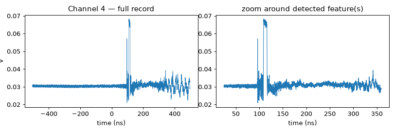](waveforms/shot_9.png) |
| 11 | ✅ | — | [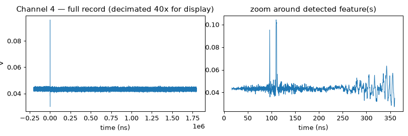](waveforms/shot_11.png) |
| 15 | ✅ | — | [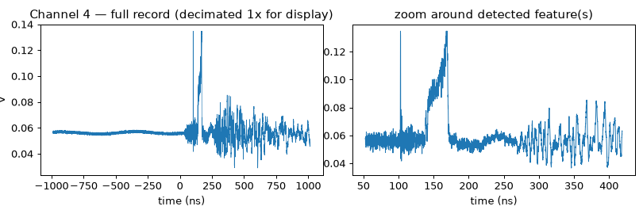](waveforms/shot_15.png) |
| 16 | ✅ | — |  |
| 18 | ✅ | ✅ |  |
| 19 | ✅ | ✅ | [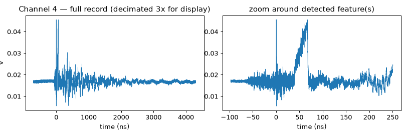](waveforms/shot_19.png) |
| 20 | ✅ | ✅ |  |
| 21 | ✅ | ✅ | [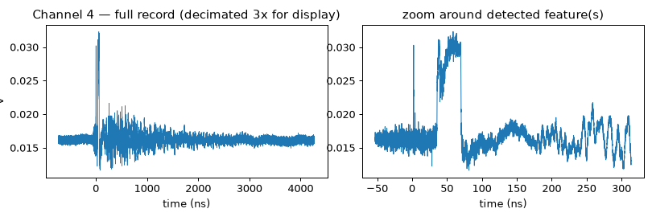](waveforms/shot_21.png) |
| 22 | ✅ | ✅ | [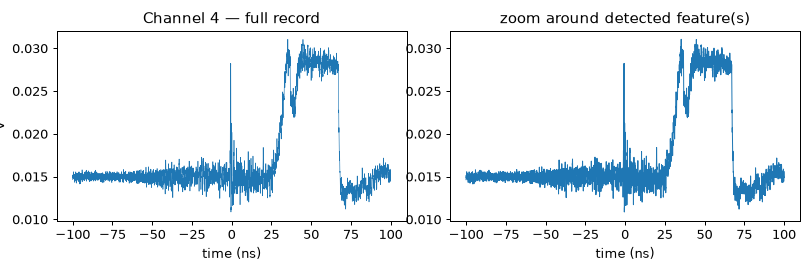](waveforms/shot_22.png) |
| 25 | ✅ | ✅ | [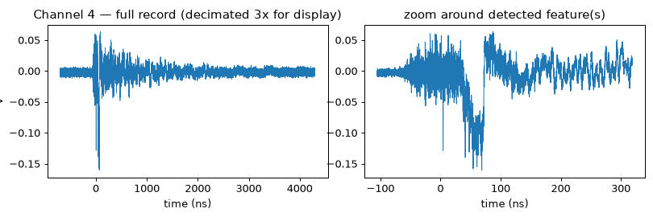](waveforms/shot_25.png) |
| 26 | ✅ | ✅ | [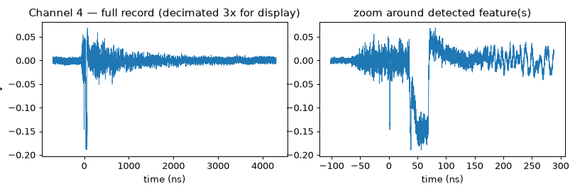](waveforms/shot_26.png) |
| 27 | ✅ | — | [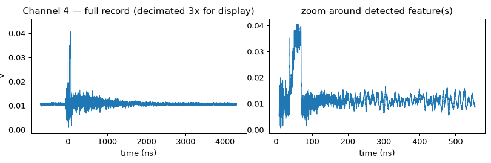](waveforms/shot_27.png) |

### 🟢 Single narrow pulse (15 shots)

| Shot | Log | Has ref ch. (Ch2) | Waveform |
|---|---|---|---|
| 12 | ❌ | — | [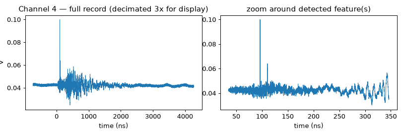](waveforms/shot_12.png) |
| 13 | ❌ | — |  |
| 28 | ❌ | — | [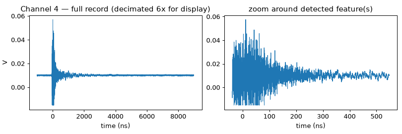](waveforms/shot_28.png) |
| 29 | ❌ | — | [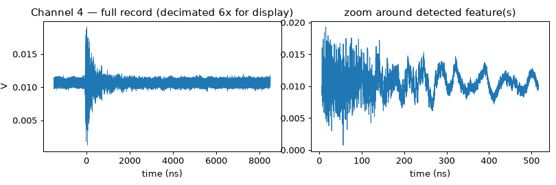](waveforms/shot_29.png) |
| 30 | ❌ | — | [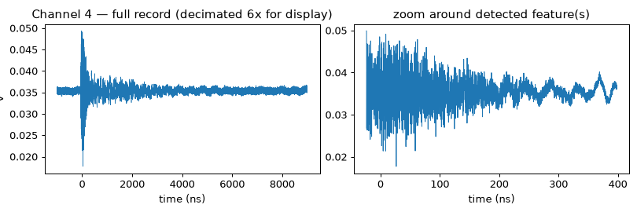](waveforms/shot_30.png) |
| 32 | ❌ | ✅ |  |
| 34 | ❌ | ✅ | [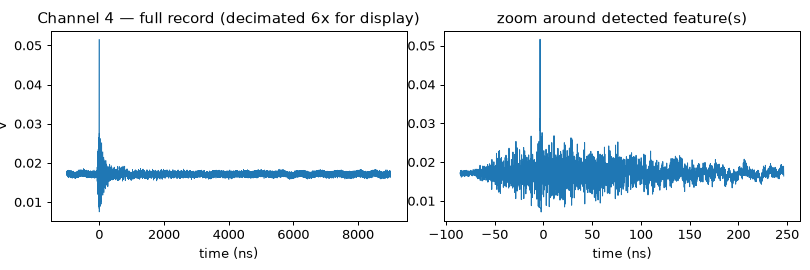](waveforms/shot_34.png) |
| 35 | ✅ | ✅ | [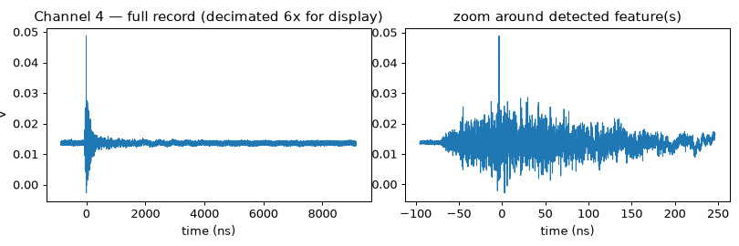](waveforms/shot_35.png) |
| 36 | ✅ | ✅ | [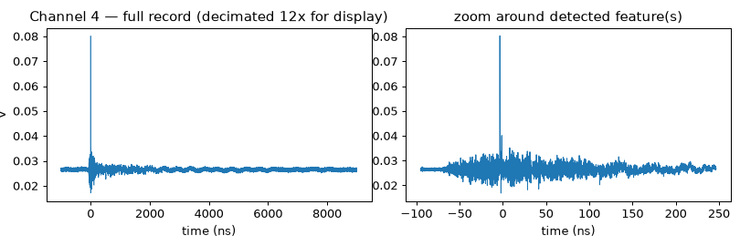](waveforms/shot_36.png) |
| 37 | ✅ | ✅ | [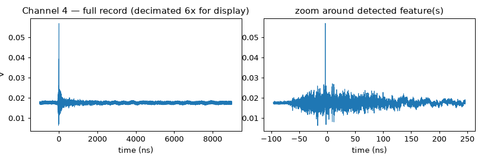](waveforms/shot_37.png) |
| 38 | ✅ | ✅ | [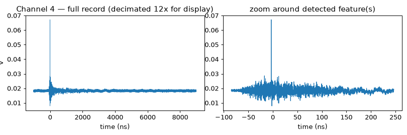](waveforms/shot_38.png) |
| 39 | ✅ | ✅ | [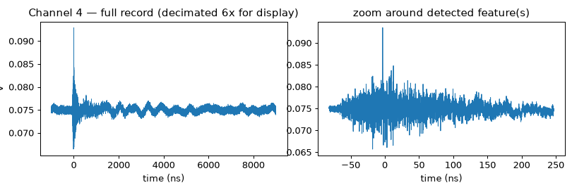](waveforms/shot_39.png) |
| 41 | ✅ | ✅ | [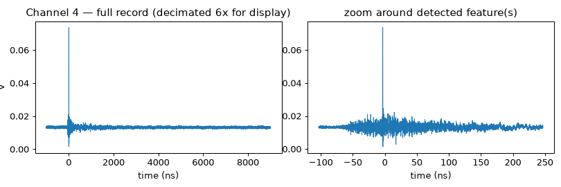](waveforms/shot_41.png) |
| 42 | ✅ | ✅ | [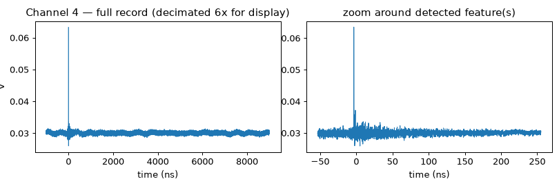](waveforms/shot_42.png) |
| 43 | ✅ | ✅ | [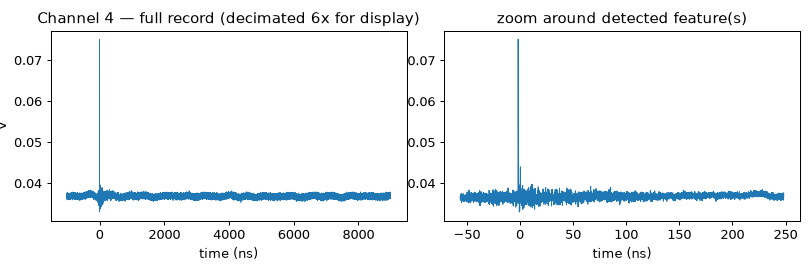](waveforms/shot_43.png) |

### 🟡 Broad unresolved feature (no distinct sub-peaks) (1 shot)

| Shot | Log | Has ref ch. (Ch2) | Waveform |
|---|---|---|---|
| 17 | ✅ | ✅ |  |

### 🔴 Saturated / clipped pulse (6 shots)

| Shot | Log | Has ref ch. (Ch2) | Waveform |
|---|---|---|---|
| 3 | ✅ | — | [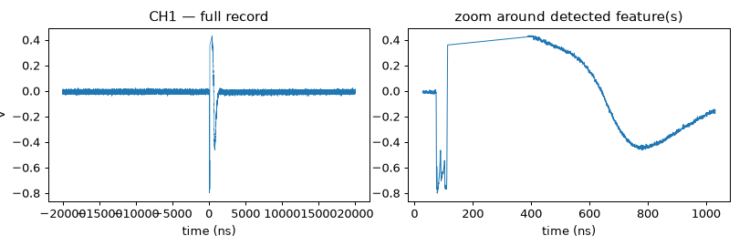](waveforms/shot_3.png) |
| 4 | ❌ | — | [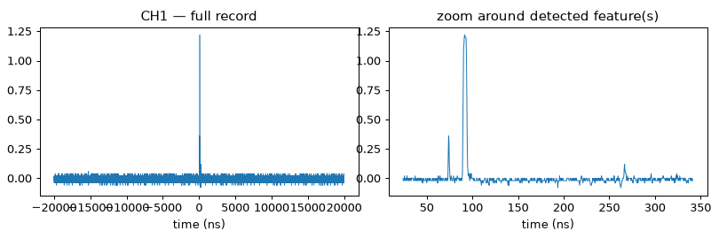](waveforms/shot_4.png) |
| 5 | ❌ | — |  |
| 6 | ❌ | — | [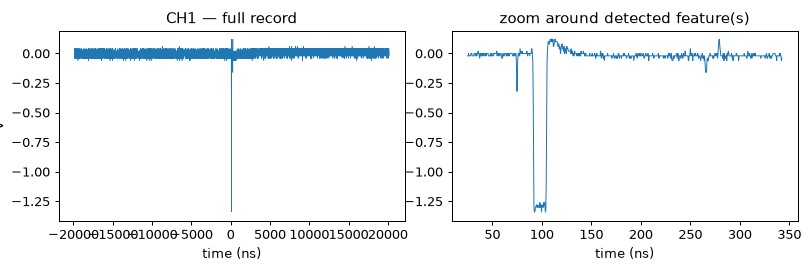](waveforms/shot_6.png) |
| 7 | ✅ | — | [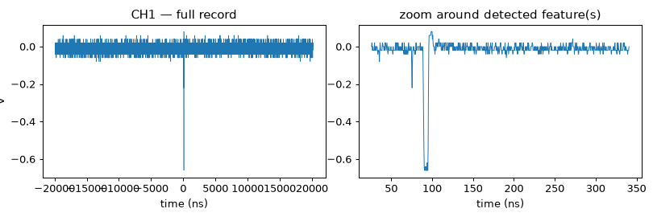](waveforms/shot_7.png) |
| 10 | ✅ | — | [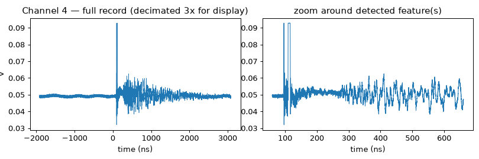](waveforms/shot_10.png) |

### 🔴 No significant pulse (noise-level) (3 shots)

| Shot | Log | Has ref ch. (Ch2) | Waveform |
|---|---|---|---|
| 1 | ✅ | — | [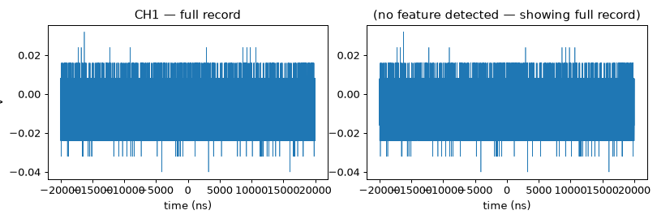](waveforms/shot_1.png) |
| 8 | ✅ | — | [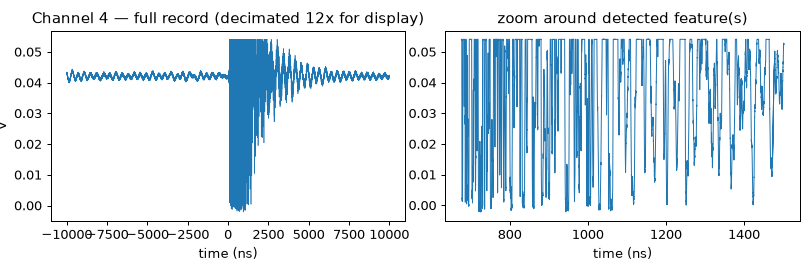](waveforms/shot_8.png) |
| 23 | ❌ | ✅ |  |

### 🔴 NO DATA FILE (6 shots)

| Shot | Log | Has ref ch. (Ch2) | Waveform |
|---|---|---|---|
| 2 | ❌ | — | — |
| 14 | ❌ | — | — |
| 24 | ❌ | — | — |
| 31 | ❌ | — | — |
| 33 | ❌ | — | — |
| 40 | ❌ | — | — |

## Quick takeaways

- **Reference channel coverage lines up with campaign date, not category.**
  Shots 1–13 never have Channel 2 (older single-channel setup). From shot 17
  onward it's standard on every shot with data — **except 27–30**, which
  were captured single-channel again for some reason (all early-Al/blocked
  shots; worth asking whoever ran those). Shot 32 (also from that stretch)
  does have Channel 2, so it's specifically 27–30, not the whole run.
