# shot_characterization

`characterize.py` — the automated pulse-finder. `verified_categories.py` —
**the authoritative category for each shot**, from a full manual review
(every one of the 37 shots-with-data checked by eye against its waveform,
2026-08-13). Use `VERIFIED_CATEGORY` for anything that matters; treat
`characterize()`'s own `category` field as a rough first pass only — it's
known to over-split noisy "sharp x-ray spike + broad proton hump" shots
into too many sub-features, which is why 8 of the 37 needed correcting
during review (see the table below and `verified_categories.py` for which).

## Categories

| | Category | Meaning |
|---|---|---|
| 🟢 | `Single narrow/broad pulse` | One clean feature |
| 🟢 | `Double pulse (prompt + delayed candidate)` | Two features — the classic x-ray-then-proton TOF signature |
| 🟡 | `Multi-pulse / complex structure` | 3+ features — often cable ringing/reflections rather than real physics, check manually |
| 🟡 | `Broad unresolved feature` | Above threshold but never resolves into a discrete feature |
| 🔴 | `No significant pulse (noise-level)` | No real pulse shape — either genuinely low SNR, or (after review) high-amplitude ringing with no distinguishable pulse |
| 🔴 | `Saturated / clipped pulse` | Hard ADC/inf clip, or a shape-based flat-top/plateau detector (see `characterize.py`) |
| 🔴 | `NO DATA FILE` | Nothing in the archive for this shot |

**Log** column is the shot-log's own good/bad call (✅/❌), independent of the
category above — a shot can be logged good but still land in 🔴/🟡 here (or
vice versa; shot 7 is logged good but is clearly saturated by eye, kept as
🔴 on shape). Waveform images are click-to-enlarge.

## Every shot (verified)

| Shot | Log | Category | Waveform |
|---|---|---|---|
| 1 | ✅ | 🔴 No significant pulse (noise-level) | [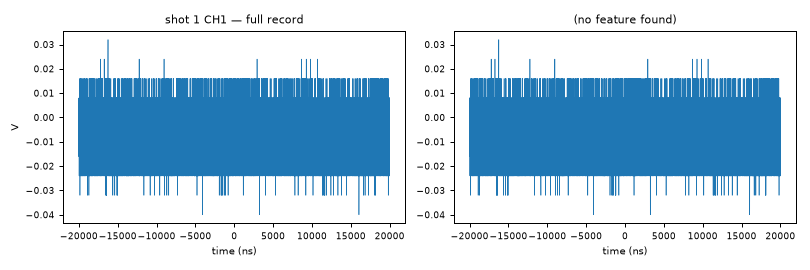](waveforms/shot_1.png) |
| 2 | ❌ | 🔴 NO DATA FILE | — |
| 3 | ✅ | 🔴 Saturated / clipped pulse | [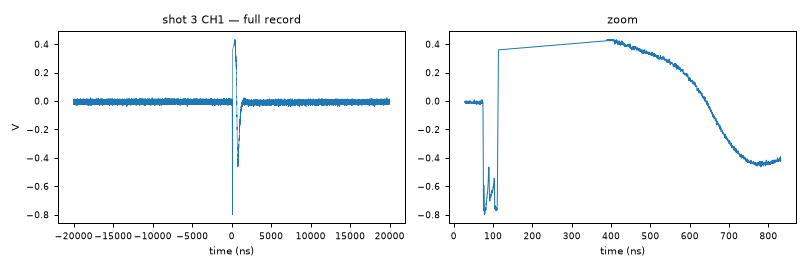](waveforms/shot_3.png) |
| 4 | ❌ | 🔴 Saturated / clipped pulse | [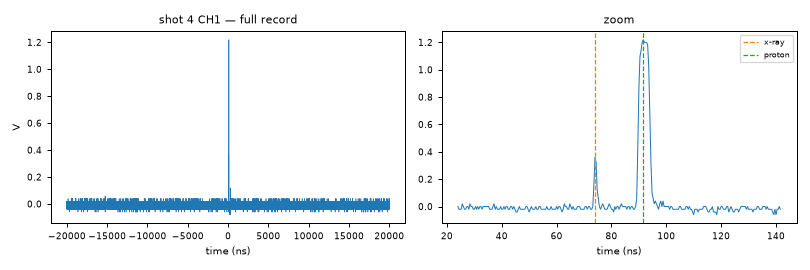](waveforms/shot_4.png) |
| 5 | ❌ | 🔴 Saturated / clipped pulse | [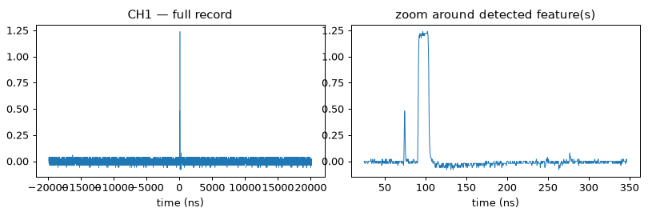](waveforms/shot_5.png) |
| 6 | ❌ | 🔴 Saturated / clipped pulse | [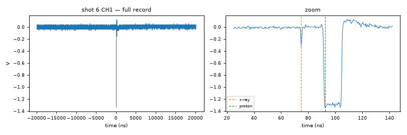](waveforms/shot_6.png) |
| 7 | ✅ | 🔴 Saturated / clipped pulse | [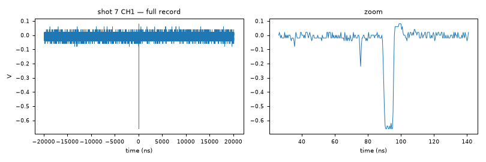](waveforms/shot_7.png) |
| 8 | ✅ | 🔴 No significant pulse (noise-level) | [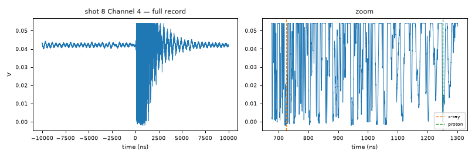](waveforms/shot_8.png) |
| 9 | ✅ | 🟢 Double pulse (prompt + delayed candidate) | [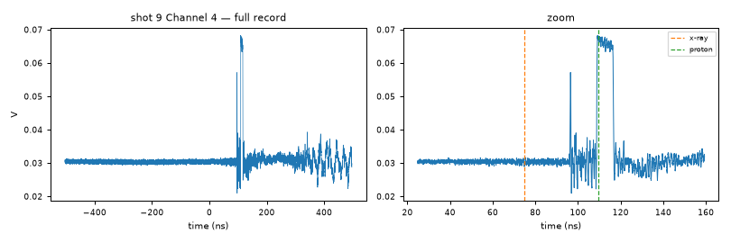](waveforms/shot_9.png) |
| 10 | ✅ | 🔴 Saturated / clipped pulse |  |
| 11 | ✅ | 🟡 Multi-pulse / complex structure | [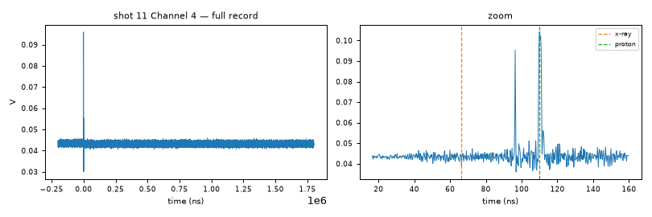](waveforms/shot_11.png) |
| 12 | ❌ | 🟢 Single narrow pulse |  |
| 13 | ❌ | 🟢 Single narrow pulse |  |
| 14 | ❌ | 🔴 NO DATA FILE | — |
| 15 | ✅ | 🟢 Double pulse (prompt + delayed candidate) |  |
| 16 | ✅ | 🟢 Double pulse (prompt + delayed candidate) | [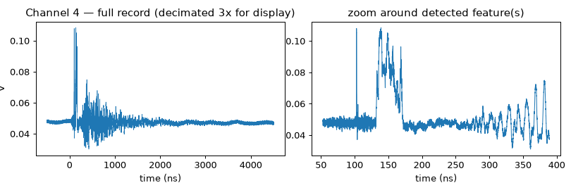](waveforms/shot_16.png) |
| 17 | ✅ | 🟡 Broad unresolved feature (no distinct sub-peaks) | [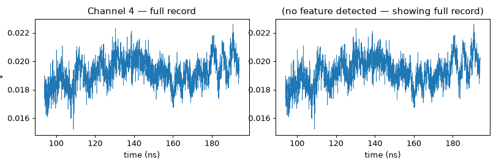](waveforms/shot_17.png) |
| 18 | ✅ | 🟢 Double pulse (prompt + delayed candidate) | [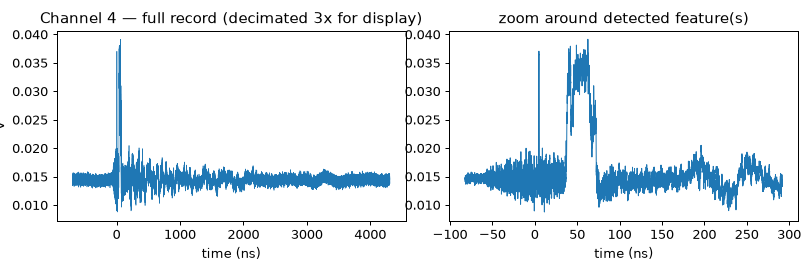](waveforms/shot_18.png) |
| 19 | ✅ | 🟢 Double pulse (prompt + delayed candidate) | [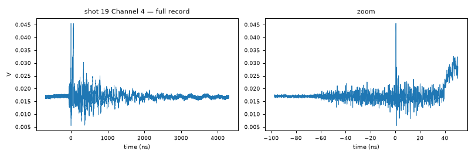](waveforms/shot_19.png) |
| 20 | ✅ | 🟢 Double pulse (prompt + delayed candidate) | [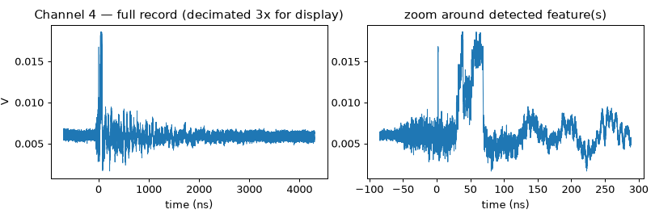](waveforms/shot_20.png) |
| 21 | ✅ | 🟢 Double pulse (prompt + delayed candidate) | [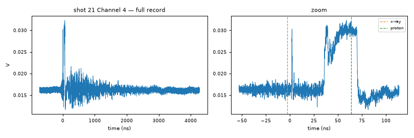](waveforms/shot_21.png) |
| 22 | ✅ | 🟢 Double pulse (prompt + delayed candidate) | [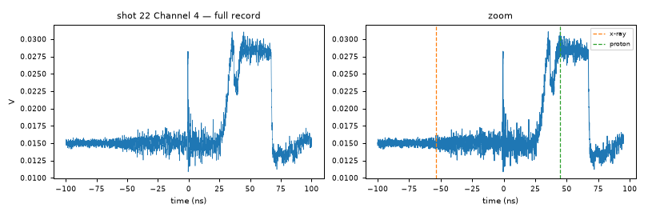](waveforms/shot_22.png) |
| 23 | ❌ | 🔴 No significant pulse (noise-level) | [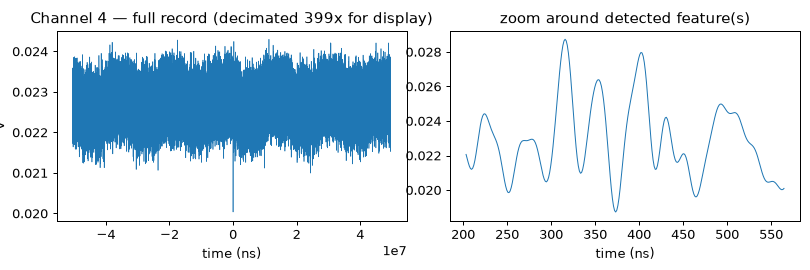](waveforms/shot_23.png) |
| 24 | ❌ | 🔴 NO DATA FILE | — |
| 25 | ✅ | 🟢 Double pulse (prompt + delayed candidate) | [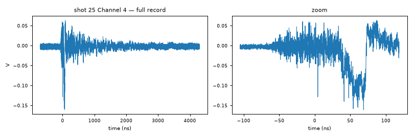](waveforms/shot_25.png) |
| 26 | ✅ | 🟢 Double pulse (prompt + delayed candidate) |  |
| 27 | ✅ | 🟢 Double pulse (prompt + delayed candidate) | [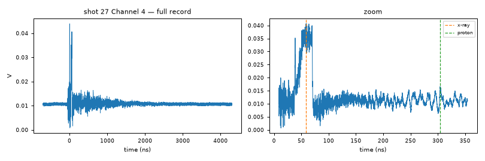](waveforms/shot_27.png) |
| 28 | ❌ | 🟢 Single narrow pulse | [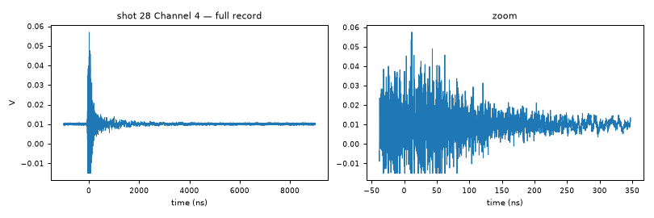](waveforms/shot_28.png) |
| 29 | ❌ | 🟢 Single narrow pulse | [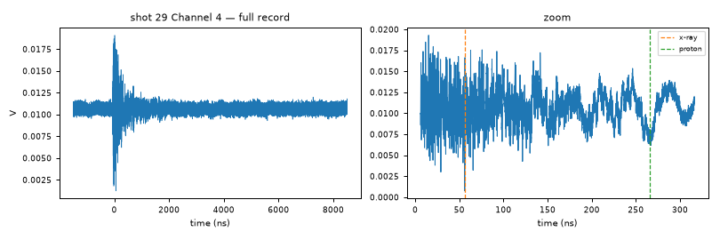](waveforms/shot_29.png) |
| 30 | ❌ | 🟢 Single narrow pulse | [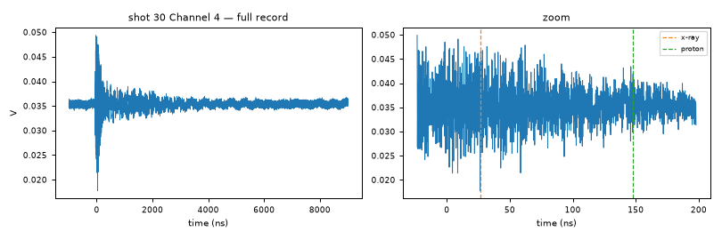](waveforms/shot_30.png) |
| 31 | ❌ | 🔴 NO DATA FILE | — |
| 32 | ❌ | 🟢 Single narrow pulse | [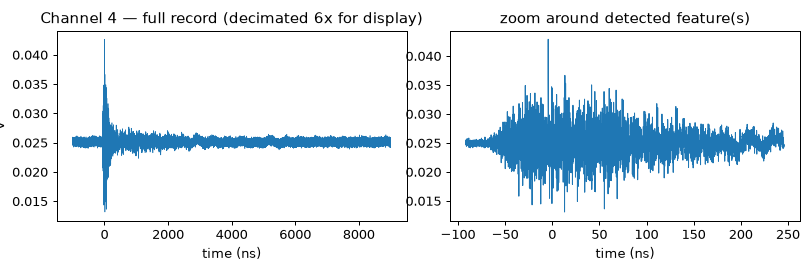](waveforms/shot_32.png) |
| 33 | ❌ | 🔴 NO DATA FILE | — |
| 34 | ❌ | 🟢 Single narrow pulse | [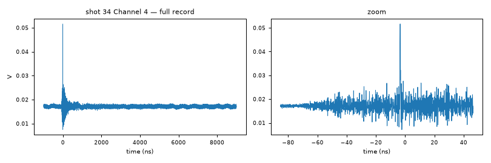](waveforms/shot_34.png) |
| 35 | ✅ | 🟢 Single narrow pulse | [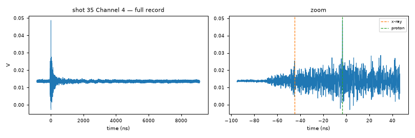](waveforms/shot_35.png) |
| 36 | ✅ | 🟢 Single narrow pulse | [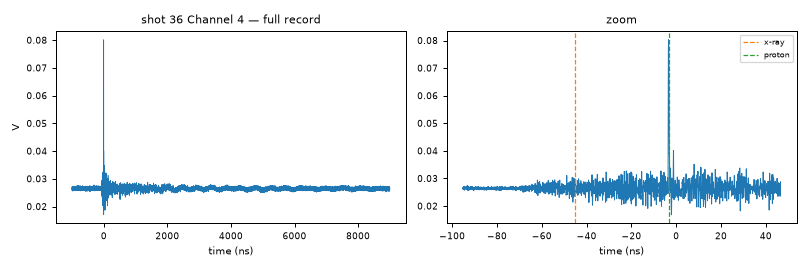](waveforms/shot_36.png) |
| 37 | ✅ | 🟢 Single narrow pulse | [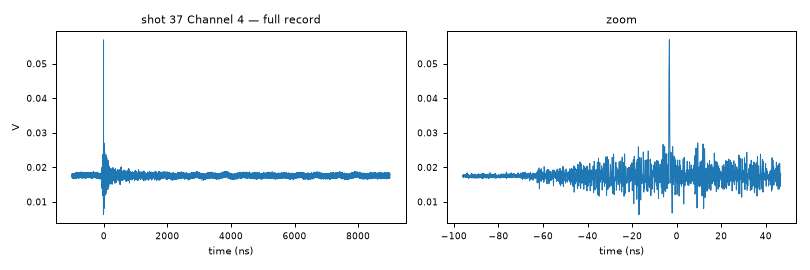](waveforms/shot_37.png) |
| 38 | ✅ | 🟢 Single narrow pulse | [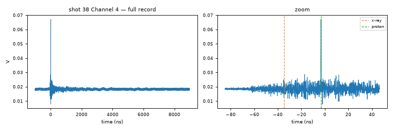](waveforms/shot_38.png) |
| 39 | ✅ | 🟢 Single narrow pulse | [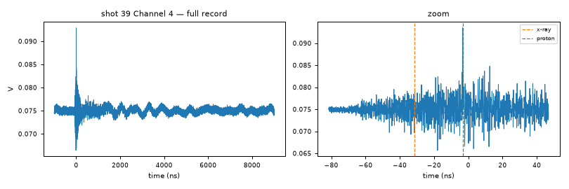](waveforms/shot_39.png) |
| 40 | ❌ | 🔴 NO DATA FILE | — |
| 41 | ✅ | 🟢 Single narrow pulse | [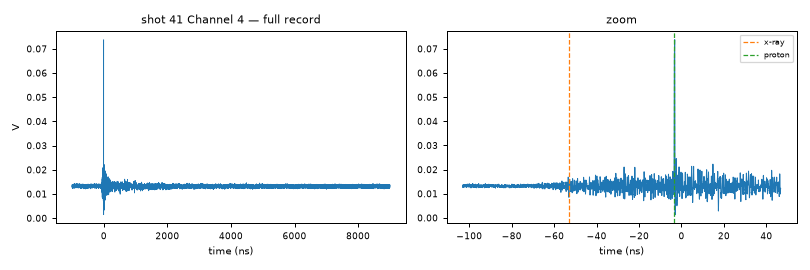](waveforms/shot_41.png) |
| 42 | ✅ | 🟢 Single narrow pulse |  |
| 43 | ✅ | 🟢 Single narrow pulse | [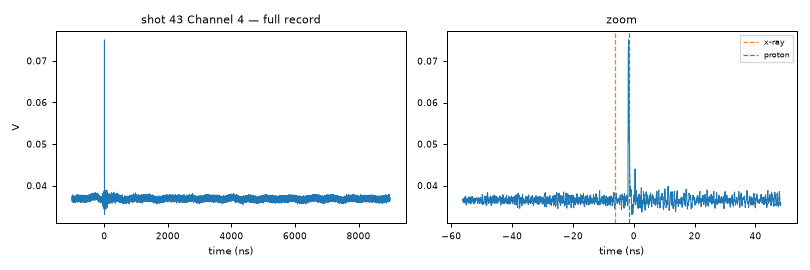](waveforms/shot_43.png) |

See [BY_CATEGORY.md](BY_CATEGORY.md) for the same shots grouped by category
instead (and which ones have the reference channel).

feature). A real fix needs to distinguish "noisy but one broad feature"
from "two separate features" some other way — e.g. envelope-based merging
instead of a flat time gap. Until then, `VERIFIED_CATEGORY` is correct;
`characterize()`'s raw output on these 8 shots is not.
